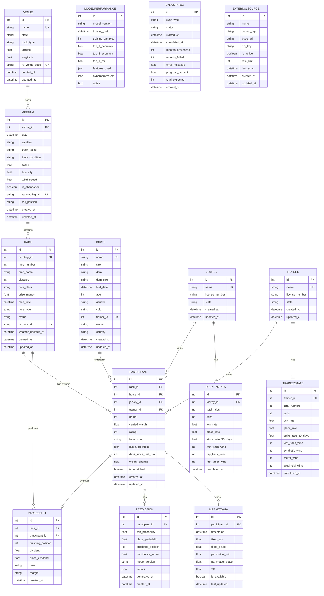

# Australian Horse Racing Prediction System - Database Design

## Overview

This document outlines the comprehensive database design for the AussieTrack Predictor system. The database is built using PostgreSQL and stores horse racing data from Australian races, including meeting information, race details, horse/participant data, historical results, odds/market data, and ML predictions.

## Database Configuration

- **Database Engine**: PostgreSQL
- **Host**: localhost
- **Port**: 5432
- **Database Name**: horse_racing_db
- **Connection String**: `postgresql://sreeni.chinthakunta@localhost:5432/horse_racing_db`

---

## Entity-Relationship Diagram



---

## Table Definitions

### 1. VENUES Table

Stores information about racing venues/tracks across Australia.

| Column | Data Type | Constraints | Description |
|--------|-----------|-------------|-------------|
| id | INTEGER | PRIMARY KEY | Auto-increment primary key |
| name | VARCHAR(200) | UNIQUE, NOT NULL | Venue name (e.g., "Flemington", "Randwick") |
| state | VARCHAR(10) | NOT NULL | Australian state (VIC, NSW, QLD, WA, SA, TAS, ACT, NT) |
| track_type | VARCHAR(50) | | Track surface (Turf, Synthetic, Dirt) |
| latitude | FLOAT | | Geographic latitude |
| longitude | FLOAT | | Geographic longitude |
| ra_venue_code | VARCHAR(50) | UNIQUE | Racing Australia venue code |
| created_at | DATETIME | DEFAULT NOW() | Record creation timestamp |
| updated_at | DATETIME | DEFAULT NOW() | Record update timestamp |

**Indexes:**
- `idx_venue_name` on `name`
- `idx_venue_state` on `state`
- `idx_venue_ra_code` on `ra_venue_code`

---

### 2. MEETINGS Table

Represents a race meeting (typically one day at one venue).

| Column | Data Type | Constraints | Description |
|--------|-----------|-------------|-------------|
| id | INTEGER | PRIMARY KEY | Auto-increment primary key |
| venue_id | INTEGER | FOREIGN KEY -> venues.id | Reference to venue |
| date | DATETIME | NOT NULL | Meeting date |
| weather | VARCHAR(50) | | Weather conditions (Fine, Overcast, Rain) |
| track_rating | VARCHAR(20) | | Track rating (Good 4, Soft 5, Heavy 8) |
| track_condition | VARCHAR(50) | | Track condition description |
| rainfall | FLOAT | | Rainfall in mm |
| humidity | FLOAT | | Humidity percentage |
| wind_speed | FLOAT | | Wind speed |
| is_abandoned | BOOLEAN | DEFAULT FALSE | Whether meeting was abandoned |
| ra_meeting_id | VARCHAR(100) | UNIQUE | Racing Australia meeting ID |
| rail_position | VARCHAR(100) | | Rail position info |
| created_at | DATETIME | DEFAULT NOW() | Record creation timestamp |
| updated_at | DATETIME | DEFAULT NOW() | Record update timestamp |

**Indexes:**
- `idx_meeting_date` on `date`
- `idx_meeting_venue` on `venue_id`
- `idx_meeting_ra_id` on `ra_meeting_id`

---

### 3. RACES Table

Individual races within a meeting.

| Column | Data Type | Constraints | Description |
|--------|-----------|-------------|-------------|
| id | INTEGER | PRIMARY KEY | Auto-increment primary key |
| meeting_id | INTEGER | FOREIGN KEY -> meetings.id | Reference to meeting |
| race_number | INTEGER | NOT NULL | Race number at meeting |
| race_name | VARCHAR(300) | | Name of the race |
| distance | INTEGER | NOT NULL | Race distance in meters |
| race_class | VARCHAR(100) | | Race class (Group 1, Benchmark 70, etc.) |
| prize_money | FLOAT | | Total prize money |
| race_time | DATETIME | NOT NULL | Scheduled race time |
| race_type | VARCHAR(50) | | Type (Gallops, Harness, Greyhounds) |
| status | VARCHAR(20) | DEFAULT 'scheduled' | Status (scheduled, completed, abandoned) |
| ra_race_id | VARCHAR(100) | UNIQUE | Racing Australia race ID |
| weather_updated_at | DATETIME | | Last weather update time |
| created_at | DATETIME | DEFAULT NOW() | Record creation timestamp |
| updated_at | DATETIME | DEFAULT NOW() | Record update timestamp |

**Indexes:**
- `idx_race_meeting` on `meeting_id`
- `idx_race_time` on `race_time`
- `idx_race_status` on `status`
- `idx_race_ra_id` on `ra_race_id`

---

### 4. HORSES Table

Master data for horses.

| Column | Data Type | Constraints | Description |
|--------|-----------|-------------|-------------|
| id | INTEGER | PRIMARY KEY | Auto-increment primary key |
| name | VARCHAR(200) | UNIQUE, NOT NULL | Horse name |
| sire | VARCHAR(200) | | Sire (father) name |
| dam | VARCHAR(200) | | Dam (mother) name |
| dam_sire | VARCHAR(200) | | Dam's sire name |
| foal_date | DATETIME | | Date of birth |
| age | INTEGER | | Horse age |
| gender | VARCHAR(10) | | Gender (Colt, Filly, Mare, Gelding, Horse) |
| color | VARCHAR(50) | | Horse color |
| trainer_id | INTEGER | FOREIGN KEY -> trainers.id | Current trainer |
| owner | VARCHAR(300) | | Owner name(s) |
| country | VARCHAR(50) | | Country of origin |
| created_at | DATETIME | DEFAULT NOW() | Record creation timestamp |
| updated_at | DATETIME | DEFAULT NOW() | Record update timestamp |

**Indexes:**
- `idx_horse_name` on `name`
- `idx_horse_sire` on `sire`
- `idx_horse_dam` on `dam`
- `idx_horse_trainer` on `trainer_id`

---

### 5. JOCKEYS Table

Master data for jockeys.

| Column | Data Type | Constraints | Description |
|--------|-----------|-------------|-------------|
| id | INTEGER | PRIMARY KEY | Auto-increment primary key |
| name | VARCHAR(200) | UNIQUE, NOT NULL | Jockey name |
| license_number | VARCHAR(50) | | License/registration number |
| state | VARCHAR(10) | | Primary state of operation |
| created_at | DATETIME | DEFAULT NOW() | Record creation timestamp |
| updated_at | DATETIME | DEFAULT NOW() | Record update timestamp |

**Indexes:**
- `idx_jockey_name` on `name`

---

### 6. TRAINERS Table

Master data for trainers.

| Column | Data Type | Constraints | Description |
|--------|-----------|-------------|-------------|
| id | INTEGER | PRIMARY KEY | Auto-increment primary key |
| name | VARCHAR(200) | UNIQUE, NOT NULL | Trainer name |
| license_number | VARCHAR(50) | | License/registration number |
| state | VARCHAR(10) | | Primary state of operation |
| created_at | DATETIME | DEFAULT NOW() | Record creation timestamp |
| updated_at | DATETIME | DEFAULT NOW() | Record update timestamp |

**Indexes:**
- `idx_trainer_name` on `name`

---

### 7. PARTICIPANTS Table

The junction table linking horses to races (runners).

| Column | Data Type | Constraints | Description |
|--------|-----------|-------------|-------------|
| id | INTEGER | PRIMARY KEY | Auto-increment primary key |
| race_id | INTEGER | FOREIGN KEY -> races.id | Reference to race |
| horse_id | INTEGER | FOREIGN KEY -> horses.id | Reference to horse |
| jockey_id | INTEGER | FOREIGN KEY -> jockeys.id | Jockey riding this horse |
| trainer_id | INTEGER | FOREIGN KEY -> trainers.id | Trainer of this horse |
| barrier | INTEGER | | Barrier (starting position) |
| carried_weight | FLOAT | | Weight carried in kg |
| rating | INTEGER | | Handicap rating |
| form_string | VARCHAR(50) | | Last 5 finishes (e.g., "1-2-3-4-5") |
| last_5_positions | JSON | | Array of last 5 positions [1, 3, 2, 5, 1] |
| days_since_last_run | INTEGER | | Days since last race |
| weight_change | FLOAT | | Weight change from last run |
| is_scratched | BOOLEAN | DEFAULT FALSE | Whether horse was scratched |
| created_at | DATETIME | DEFAULT NOW() | Record creation timestamp |
| updated_at | DATETIME | DEFAULT NOW() | Record update timestamp |

**Indexes:**
- `idx_participant_race` on `race_id`
- `idx_participant_horse` on `horse_id`
- `idx_participant_jockey` on `jockey_id`
- `idx_participant_trainer` on `trainer_id`
- `idx_participant_scratched` on `is_scratched`

---

### 8. RACE_RESULTS Table

Official race results.

| Column | Data Type | Constraints | Description |
|--------|-----------|-------------|-------------|
| id | INTEGER | PRIMARY KEY | Auto-increment primary key |
| race_id | INTEGER | FOREIGN KEY -> races.id | Reference to race |
| participant_id | INTEGER | FOREIGN KEY -> participants.id | Reference to participant |
| finishing_position | INTEGER | NOT NULL | Final position (1=first, 2=second, etc.) |
| dividend | FLOAT | | Win dividend |
| place_dividend | FLOAT | | Place dividend |
| time | VARCHAR(20) | | Race time |
| margin | VARCHAR(20) | | Margin behind winner |
| created_at | DATETIME | DEFAULT NOW() | Record creation timestamp |

**Indexes:**
- `idx_result_race` on `race_id`
- `idx_result_participant` on `participant_id`
- `idx_result_position` on `finishing_position`

---

### 9. PREDICTIONS Table

ML model predictions for each participant.

| Column | Data Type | Constraints | Description |
|--------|-----------|-------------|-------------|
| id | INTEGER | PRIMARY KEY | Auto-increment primary key |
| participant_id | INTEGER | FOREIGN KEY -> participants.id | Reference to participant |
| win_probability | FLOAT | NOT NULL | Predicted win probability (0.0-1.0) |
| place_probability | FLOAT | | Predicted place probability (0.0-1.0) |
| predicted_position | INTEGER | | Predicted finishing position |
| confidence_score | FLOAT | | Model confidence (0.0-1.0) |
| model_version | VARCHAR(50) | | Version of ML model used |
| factors | JSON | | Key factors influencing prediction |
| generated_at | DATETIME | DEFAULT NOW() | When prediction was generated |
| created_at | DATETIME | DEFAULT NOW() | Record creation timestamp |

**Indexes:**
- `idx_prediction_participant` on `participant_id`
- `idx_prediction_model` on `model_version`
- `idx_prediction_generated` on `generated_at`

---

### 10. JOCKEY_STATISTICS Table

Aggregated performance statistics for jockeys.

| Column | Data Type | Constraints | Description |
|--------|-----------|-------------|-------------|
| id | INTEGER | PRIMARY KEY | Auto-increment primary key |
| jockey_id | INTEGER | FOREIGN KEY -> jockeys.id | Reference to jockey |
| total_rides | INTEGER | DEFAULT 0 | Total number of rides |
| wins | INTEGER | DEFAULT 0 | Total wins |
| win_rate | FLOAT | DEFAULT 0.0 | Win percentage |
| place_rate | FLOAT | DEFAULT 0.0 | Place percentage |
| strike_rate_30_days | FLOAT | DEFAULT 0.0 | 30-day strike rate |
| wet_track_wins | INTEGER | DEFAULT 0 | Wins on wet tracks |
| dry_track_wins | INTEGER | DEFAULT 0 | Wins on dry tracks |
| first_timer_wins | INTEGER | DEFAULT 0 | Wins on first-time runners |
| calculated_at | DATETIME | DEFAULT NOW() | When stats were calculated |

**Indexes:**
- `idx_jockstat_jockey` on `jockey_id`

---

### 11. TRAINER_STATISTICS Table

Aggregated performance statistics for trainers.

| Column | Data Type | Constraints | Description |
|--------|-----------|-------------|-------------|
| id | INTEGER | PRIMARY KEY | Auto-increment primary key |
| trainer_id | INTEGER | FOREIGN KEY -> trainers.id | Reference to trainer |
| total_runners | INTEGER | DEFAULT 0 | Total runners |
| wins | INTEGER | DEFAULT 0 | Total wins |
| win_rate | FLOAT | DEFAULT 0.0 | Win percentage |
| place_rate | FLOAT | DEFAULT 0.0 | Place percentage |
| strike_rate_30_days | FLOAT | DEFAULT 0.0 | 30-day strike rate |
| wet_track_wins | INTEGER | DEFAULT 0 | Wins on wet tracks |
| synthetic_wins | INTEGER | DEFAULT 0 | Wins on synthetic tracks |
| metro_wins | INTEGER | DEFAULT 0 | Wins at metro tracks |
| provincial_wins | INTEGER | DEFAULT 0 | Wins at provincial tracks |
| calculated_at | DATETIME | DEFAULT NOW() | When stats were calculated |

**Indexes:**
- `idx_trainstat_trainer` on `trainer_id`

---

### 12. MARKET_DATA Table

Real-time odds and market data for runners.

| Column | Data Type | Constraints | Description |
|--------|-----------|-------------|-------------|
| id | INTEGER | PRIMARY KEY | Auto-increment primary key |
| participant_id | INTEGER | FOREIGN KEY -> participants.id | Reference to participant |
| timestamp | DATETIME | NOT NULL, DEFAULT NOW() | When odds were captured |
| fixed_win | FLOAT | | Fixed odds for win |
| fixed_place | FLOAT | | Fixed odds for place |
| parimutuel_win | FLOAT | | Tote odds for win |
| parimutuel_place | FLOAT | | Tote odds for place |
| SP | FLOAT | | Starting Price |
| is_available | BOOLEAN | DEFAULT TRUE | Whether odds are available |
| last_updated | DATETIME | DEFAULT NOW() | Last update timestamp |

**Indexes:**
- `idx_market_participant` on `participant_id`
- `idx_market_timestamp` on `timestamp`

---

### 13. MODEL_PERFORMANCE Table

Track ML model training and performance metrics.

| Column | Data Type | Constraints | Description |
|--------|-----------|-------------|-------------|
| id | INTEGER | PRIMARY KEY | Auto-increment primary key |
| model_version | VARCHAR(50) | NOT NULL | Model version identifier |
| training_date | DATETIME | DEFAULT NOW() | When model was trained |
| training_samples | INTEGER | | Number of training samples |
| top_1_accuracy | FLOAT | | Top-1 prediction accuracy |
| top_3_accuracy | FLOAT | | Top-3 prediction accuracy |
| top_1_roi | FLOAT | | Return on investment |
| features_used | JSON | | List of features used |
| hyperparameters | JSON | | Model hyperparameters |
| notes | TEXT | | Additional notes |

**Indexes:**
- `idx_model_version` on `model_version`
- `idx_model_date` on `training_date`

---

### 14. SYNC_STATUS Table

Track data sync status and scheduling.

| Column | Data Type | Constraints | Description |
|--------|-----------|-------------|-------------|
| id | INTEGER | PRIMARY KEY | Auto-increment primary key |
| sync_type | VARCHAR(50) | NOT NULL | Type (historical, live, weather) |
| status | VARCHAR(20) | DEFAULT 'idle' | Status (idle, running, completed, failed) |
| started_at | DATETIME | | When sync started |
| completed_at | DATETIME | | When sync completed |
| records_processed | INTEGER | DEFAULT 0 | Number of records processed |
| records_failed | INTEGER | DEFAULT 0 | Number of failed records |
| error_message | TEXT | | Error details if failed |
| progress_percent | FLOAT | DEFAULT 0.0 | Progress percentage |
| total_expected | INTEGER | DEFAULT 0 | Expected total records |
| created_at | DATETIME | DEFAULT NOW() | Record creation timestamp |

**Indexes:**
- `idx_sync_type` on `sync_type`
- `idx_sync_status` on `status`

---

### 15. EXTERNAL_SOURCES Table

Track external data sources and their configuration.

| Column | Data Type | Constraints | Description |
|--------|-----------|-------------|-------------|
| id | INTEGER | PRIMARY KEY | Auto-increment primary key |
| name | VARCHAR(100) | NOT NULL | Source name |
| source_type | VARCHAR(50) | | Type (racing_api, odds_api, weather_api) |
| base_url | VARCHAR(500) | | API base URL |
| api_key | VARCHAR(200) | | API key for authentication |
| is_active | BOOLEAN | DEFAULT TRUE | Whether source is active |
| rate_limit | INTEGER | DEFAULT 100 | Requests per minute |
| last_sync | DATETIME | | Last successful sync |
| created_at | DATETIME | DEFAULT NOW() | Record creation timestamp |
| updated_at | DATETIME | DEFAULT NOW() | Record update timestamp |

**Indexes:**
- `idx_source_type` on `source_type`
- `idx_source_active` on `is_active`

---

## Data Relationships

### Core Race Data Flow

1. **Venue** → hosts → **Meeting**
2. **Meeting** → contains → **Race**
3. **Race** → has → **Participant** (multiple)
4. **Participant** = **Horse** + **Jockey** + **Trainer** + Race-specific data

### Results Flow

1. **Race** → completes → **RaceResult** (via Participant)
2. **Participant** → achieves → **RaceResult**

### Prediction Flow

1. **Race** → scheduled → **Participant** → predicted by → **Prediction**
2. **Prediction** → based on → Features (horse stats, jockey stats, trainer stats, track conditions)

### Market Data Flow

1. **Participant** → has → **MarketData** (updated regularly)
2. **ExternalSource** → provides data to → **MarketData**

### Statistics Flow

1. **Jockey** → has → **JockeyStatistics** (calculated from RaceResults)
2. **Trainer** → has → **TrainerStatistics** (calculated from RaceResults)

---

## Feature Engineering for ML

The database supports the following key features for machine learning:

### Horse Features
- Days since last run
- Win percentage (all time)
- Win percentage at current distance
- Win percentage on current track condition
- Last 5 positions (form string)
- Age
- Weight carried

### Jockey Features
- Win rate
- 30-day strike rate
- Wet track win rate
- Dry track win rate
- First timer win rate

### Trainer Features
- Win rate
- 30-day strike rate
- Wet track wins
- Synthetic track wins
- Metro vs Provincial performance

### Race/Environment Features
- Distance
- Track type (Turf/Synthetic/Dirt)
- Track condition (Good/Soft/Heavy)
- Weather
- Barrier position
- Prize money
- Race class

---

## Current Database Statistics

As of the last sync, the database contains:

| Entity | Count |
|--------|-------|
| Venues | 61 |
| Meetings | 1,359 |
| Races | 10,118 |
| Horses | 2,702 |
| Trainers | 880 |
| Jockeys | 45 |
| Participants | 114,543 |
| Race Results | 56,180 |

---

## API Integration Points

### Racing Australia Integration
- **URL**: `https://www.racingaustralia.horse`
- **Data**: Meeting calendar, race results, horse information
- **Tables Used**: venues, meetings, races, horses, participants, race_results

### Ladbrokes/Betting APIs
- **Data**: Real-time odds
- **Tables Used**: market_data

### Weather APIs
- **Data**: Weather conditions, track conditions
- **Tables Used**: meetings, races

---

## SQL Setup Script

```sql
-- Create database
CREATE DATABASE horse_racing_db;

-- Connect to database
\c horse_racing_db;

-- Create tables (using SQLAlchemy ORM migration recommended)
-- See backend/app/models/database.py for complete schema
```

**Note**: Use Alembic or SQLAlchemy migration tools to manage schema changes.

---

## Version History

| Version | Date | Changes |
|---------|------|---------|
| 1.0.0 | 2026-03-10 | Initial design with all 15 tables |
| | | Added Racing Australia specific fields |
| | | Added ML prediction and model performance tracking |
| | | Added market data and sync status tables |
